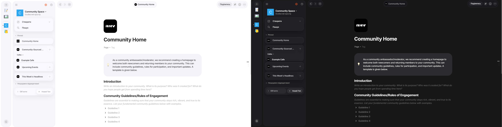

# Custom CSS Theme for Anytype

Hi, I'm **gaseth**! 

A few people asked me to share my custom styles for Anytype, so here they are. 

I created this theme to achieve a **clean interface with modern macOS vibes**. It’s not perfect—I built it primarily to suit my own needs and specific workflow—but I’m happy to share it with anyone who might find it useful.

## 🎨 About the Theme
* **Minimalist Aesthetic:** Focused on a clean, distraction-free environment.
* **macOS Inspired:** Subtle UI tweaks to give it a modern, native feel.
* **Workflow-Centric:** Many elements were adjusted specifically for what I found critical in my daily use.

> **Note:** Some things might not be "technically" perfect under the hood, as I only fixed what was essential for my own experience. If you’re looking for a polished, universal theme, keep in mind this is a personal project!

## 🛠 Compatibility & Updates
* **Current Version:** Make it for Anytype **v0.54**.
* **Maintenance:** I plan to update this periodically as Anytype evolves, but I cannot guarantee a regular or permanent update schedule. It’s a "best effort" hobby project!

## 🤝 Contributing
I’d be more than happy to improve these styles together! If you find a bug or have an idea to make the CSS cleaner or better, feel free to:
* Open an **Issue**
* Submit a **Pull Request**

## 🚀 How to Use
1.  Open Anytype.
2.  Go to `Settings` -> `Appearance`.
3.  Find the `Custom CSS` section (or use the `custom.css` file in your Anytype data folder).
4.  Copy and paste the contents of the `custom.css` from this repo.

---
**You're welcome to try it out!** Enjoy your clean workspace.
